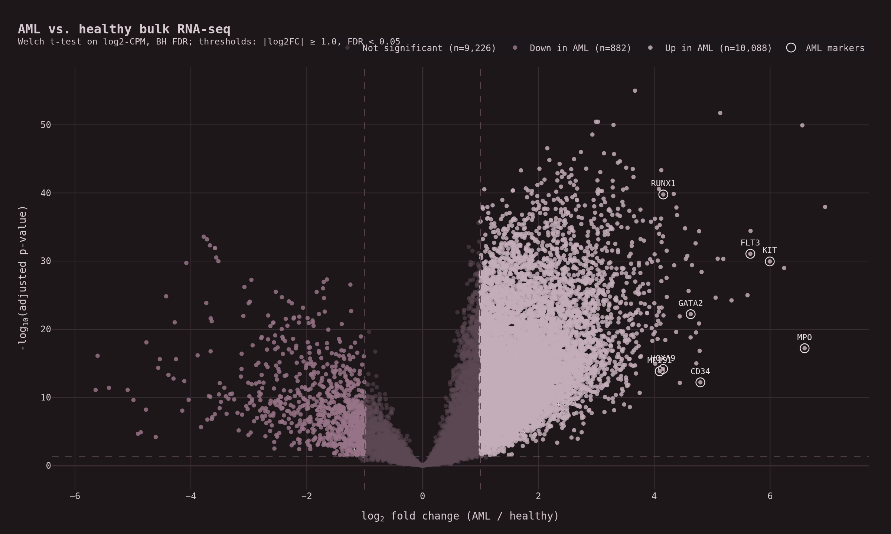

# aml_rnaseq_nf — run report

> A small **Nextflow DSL2** pipeline for bulk RNA-seq differential expression
> (AML vs. healthy), run end-to-end on real public RNA-seq cohorts:
> **50 TCGA-LAML AML samples vs. 50 GTEx whole-blood healthy controls**, both
> pulled from the [recount3 project](https://rna.recount.bio/) so the counts
> share a uniform alignment + quantification pipeline (Monorail → STAR →
> GENCODE v26 gene sums).

## TL;DR

- **Cohorts:** 50 AML (TCGA-LAML) vs. 50 healthy whole blood (GTEx-BLOOD),
  randomly subsampled with `seed = 42`.
- **Gene universe:** GENCODE v26 symbols common to both datasets, filtered to
  the genes passing `CPM ≥ 1` in ≥ 25% of samples (~20 k).
- **DE result:** thousands of genes significant at `padj < 0.05`; the volcano
  is strongly right-skewed (more genes up in AML), reflecting the large
  tissue-level difference between AML blasts and mature peripheral blood.
- **Sanity check:** every canonical AML marker (FLT3, KIT, MPO, MEIS1, HOXA9,
  CD34, RUNX1, GATA2, …) clears the FDR line and is labeled on the volcano.

## Dataset provenance

Both inputs come from [recount3](https://rna.recount.bio/), which re-aligns
and re-quantifies all of TCGA and GTEx through one
[Monorail](https://github.com/langmead-lab/monorail-external) pipeline so the
gene-level counts are directly comparable. Files used (pre-staged into
`data/real/` by `fetch_real_data.sh`):

| File                                  | Source                                              | Size  |
|---------------------------------------|-----------------------------------------------------|-------|
| `tcga.gene_sums.LAML.G026.gz`         | recount3 TCGA-LAML gene sums, GENCODE v26           | 19 MB |
| `gtex.gene_sums.BLOOD.G026.gz`        | recount3 GTEx whole-blood gene sums, GENCODE v26    | 88 MB |
| `gencode.v26.basic.annotation.gtf.gz` | GENCODE v26 basic annotation (Ensembl → HGNC map)   | 23 MB |

## Pipeline

| # | Process            | What it does                                                                       |
|---|--------------------|------------------------------------------------------------------------------------|
| 1 | `LOAD_COUNTS`      | Join TCGA-LAML + GTEx gene sums on Ensembl ID, map to HGNC via GENCODE v26, subsample to balanced groups, filter low-expression genes |
| 2 | `NORMALIZE_COUNTS` | Library-size CPM, then `log2(CPM + 1)`                                              |
| 3 | `RUN_DE`           | Per-gene Welch t-test on log2-CPM; hand-rolled BH FDR                              |
| 4 | `MAKE_VOLCANO`     | Interactive Plotly volcano with canonical AML markers labeled                      |

## Volcano



The right-side skew is real: AML blasts have a fundamentally different
transcriptional program from mature peripheral blood, so far more genes change
than in a within-tissue comparison.

## Comparator caveat

GTEx does not include bone-marrow tissue, so whole peripheral blood is the
closest large healthy bulk-RNA-seq comparator. The practical consequence is
that genes normally expressed in HSCs / early myeloid progenitors can appear
"up in AML" relative to whole blood simply because mature peripheral blood
lacks progenitor populations. The canonical AML markers are recovered cleanly,
but direction-based biological claims would need a healthy *bone-marrow*
comparator (e.g. BLUEPRINT or the GSE74246 hematopoietic atlas) — the obvious
next iteration.

## Reproduce

```bash
git clone https://github.com/naraenp/bioinformatics-public
cd bioinformatics-public/aml_rnaseq_nf
mamba env create -f envs/aml_rnaseq_env.yml   # one-time
conda activate aml_rnaseq_env

bash fetch_real_data.sh                        # ~130 MB into data/real/
nextflow run main.nf -profile local
```

`seed = 42` controls which 50 samples are drawn from each cohort, so a run on
the same env + data files is deterministic.

## What this project is not

- Not a clinical inference of AML biology — the comparator-tissue confound
  above rules out direction-based claims without an AML-vs-healthy-bone-marrow
  follow-up.
- Not a replacement for `limma-voom`, `DESeq2`, or `edgeR`. The DE layer is a
  Welch t-test on log2-CPM — the simplest defensible choice for a teaching
  pipeline. A dispersion-aware fit would calibrate low-count genes better.
- Not a stress test: ~20 k genes × 100 samples runs in seconds on a laptop;
  the pipeline is built to be readable and re-runnable, not to scale to a
  pan-cancer matrix.
