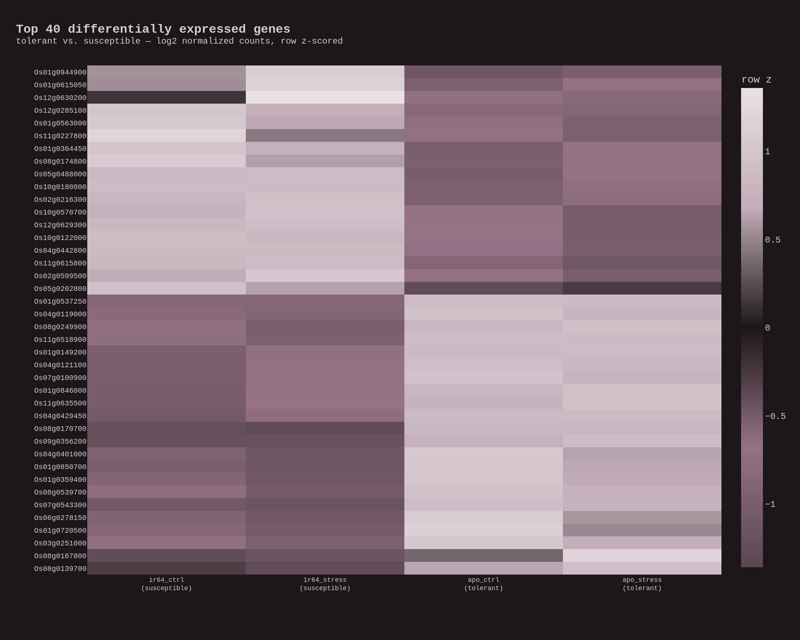
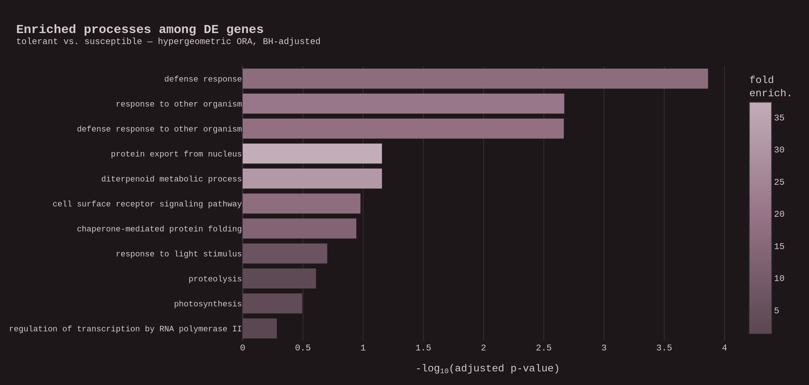

# Run report — plant_rnaseq_nf

End-to-end run of the pipeline on a drought tolerant-vs-susceptible rice
comparison, plus the offline toy-genome validation used for CI.

## Datasets

| Input | Source | Notes |
|-------|--------|-------|
| Reads | ENA, **BioProject PRJNA338445** (Wilkins et al.) | Apo (tolerant) + IR64 (susceptible), each control + drought stress; paired-end Illumina, stream-subsampled to 2 M read pairs/sample |
| Genome + GTF | Ensembl Plants **IRGSP-1.0** (release 58) | rice reference, HISAT2 index |
| GO sets | Ensembl Plants **BioMart** (`build_go_gmt.py`) | biological-process GO terms; RAP-DB `Os…` IDs match the GTF |

Design: `~condition + genotype`, contrast **tolerant vs. susceptible** (the
genotype effect estimated controlling for drought condition). The two
within-genotype libraries (control + stress) act as the contrast's replicates.

## Pipeline

`SUBSAMPLE → QC_TRIM → HISAT2_BUILD/ALIGN → QUANTIFY → BUILD_MATRIX → RUN_DE
(pydeseq2) → ENRICH (hypergeometric GO ORA) → MAKE_HEATMAP / MAKE_ENRICH_PLT.`

## Results (real rice run)

Four libraries (Apo control/stress, IR64 control/stress), 2 M read pairs each,
HISAT2 to IRGSP-1.0:

| Sample | Genotype | Overall alignment |
|--------|----------|-------------------|
| apo_ctrl    | tolerant (Apo)    | 93.56% |
| apo_stress  | tolerant (Apo)    | 93.63% |
| ir64_ctrl   | susceptible (IR64) | 87.86% |
| ir64_stress | susceptible (IR64) | 83.49% |

(The susceptible IR64 aligns a little lower — expected reference bias against the
Nipponbare/IRGSP genome.)

- **38,993** genes quantified by featureCounts; **10,454** retained after
  pydeseq2 independent filtering (non-NA padj) form the enrichment universe.
- **56** genes differentially expressed between genotypes at **padj < 0.05**
  (design `~condition + genotype`).
- **Top DE genes:** `Os02g0216300` (log2FC −11.3), `Os07g0543300` (+7.2),
  `Os08g0539700` (+5.9), `Os01g0615050` (−6.4) …
- **Enriched processes (BH padj < 0.05):** **defense response** (padj 1.4e-4),
  **response to other organism**, **defense response to other organism**; with
  **diterpenoid metabolic process** (rice phytoalexin/momilactone biosynthesis)
  and photosynthesis among the next strongest — a coherent stress/defense
  signature distinguishing the tolerant and susceptible lines.

The interactive versions are `results/heatmap.html` and
`results/enrichment.html` (embedded on the
[portfolio entry](https://naraen.net/portfolio/plant_rnaseq_proj/)).

## Validation (offline toy genome)

`bash run_local.sh --demo` synthesizes a toy genome and paired reads with a
planted tolerant-vs-susceptible signal (`bin/make_demo_data.py`), then runs the
whole DAG. The run recovers **all 18 planted DE genes** at padj < 0.05 with
log2FC ≈ the planted ±2.0, and the two GO sets seeded with DE genes come up
significant (padj ≈ 1.7e-3). The Nextflow and `run_local.sh` paths produce
**identical** `de_results.tsv`. `pytest plant_rnaseq_nf/tests/` → 7/7 pass.

## What this project is / is not

- **Is:** a reproducible, readable short-read DE workflow — raw reads to a
  phenotype-facing functional summary — that runs on a laptop.
- **Is not:** a maximally powered study. Reads are subsampled and the
  control/stress libraries stand in as replicates; adding biological replicates
  and full depth is a drop-in change. HISAT2 can be swapped for STAR.
