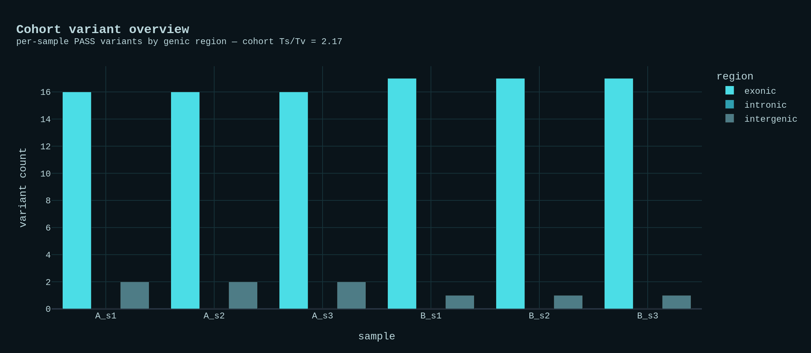
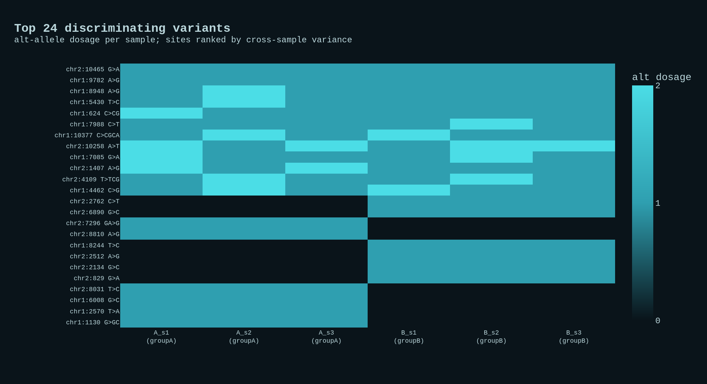

# Run report — variant_calling_nf

Germline short-variant calling with the GATK best-practice path, validated
end-to-end on an offline synthetic cohort with **planted variants**, plus a
wired real-data benchmarking run against the **GIAB HG002** truth set.

## Datasets

| Input | Source | Notes |
|-------|--------|-------|
| Demo reads + genome | synthetic (`bin/make_demo_data.py`) | toy diploid genome, 6 samples in 2 groups, planted SNVs + indels with a `truth.vcf` |
| Real reads | **GIAB / NIST HG002** (NA24385), GRCh38 chr20 300x BAM | region range-sliced over HTTPS back to FASTQ |
| Real reference | GRCh38 **chr20** (UCSC hg38) | contig `chr20`, matches the BAM + truth |
| Real annotation | **GENCODE v46** basic, chr20 | genic consequence |
| Real truth | **NIST v4.2.1** HG002 benchmark VCF + confident-region BED | restricted to the calling window |

## Pipeline

`SUBSAMPLE → QC_TRIM → PREP_REFERENCE → ALIGN (bwa mem) → MARK_DUPLICATES →
CALL_VARIANTS (HaplotypeCaller GVCF) → JOINT_GENOTYPE (CombineGVCFs +
GenotypeGVCFs) → FILTER_VARIANTS (SNP + indel hard filters) → NORMALIZE
(bcftools) → ANNOTATE → MAKE_OVERVIEW / MAKE_GENO_HEATMAP.`

## Validation (offline synthetic cohort) — executed

`bash run_local.sh --demo` synthesizes a toy diploid genome (2 chromosomes,
~24 kb) and paired reads for **6 samples** in two groups (`groupA`, `groupB`),
planting **24 variants** (19 SNV, 5 indel): 12 shared across all samples and
6 + 6 group-specific (`bin/make_demo_data.py`, seed 42). It then runs the whole
DAG and self-checks the called cohort VCF against the planted `truth.vcf`
(`bin/check_truth.py`).

Result — **perfect recovery**:

| Metric | Value | Threshold |
|--------|-------|-----------|
| truth sites (≥1 alt) | 24 | — |
| recovered (TP)       | 24 | — |
| **recall**           | **1.000** | ≥ 0.90 |
| **precision**        | **1.000** | ≥ 0.90 |
| **genotype concordance** | **1.000** (144/144 sample-genotypes) | ≥ 0.85 |
| cohort Ts/Tv (SNVs)  | 2.17 | — |

The Nextflow path and `run_local.sh` produce an **identical** `annotated.tsv`
and identical normalized variant records (24 sites), confirming the two paths
stay in sync. `pytest variant_calling_nf/tests/` → **11/11 pass**.

The genotype heatmap shows the planted structure cleanly: group-specific
variants partition into group-A and group-B blocks, with the shared variants
present across the whole cohort.

The interactive versions are `results/variant_overview.html` and
`results/genotype_heatmap.html` (embedded on the
[portfolio entry](https://naraen.net/portfolio/variant_calling_proj/)).

## Real run (GIAB HG002) — wired, reproducible

`bash fetch_real_data.sh` prepares a real germline benchmark on a
high-confidence slice of GRCh38 **chr20** (default `chr20:30,000,000–32,000,000`,
intersected with the NIST confident-region BED): GRCh38 chr20 from UCSC, HG002
reads range-sliced out of GIAB's chr20 300x BAM, GENCODE chr20 annotation, and
the NIST v4.2.1 truth restricted to the calling window. The pipeline then runs
with `--intervals data/real/intervals.bed`, and the callset is scored against
the truth with `bcftools isec` (false negatives / false positives / true
positives → recall and precision). The fetch + multi-GB-adjacent range requests
are not run in CI; the URLs are verified and the commands are emitted by
`fetch_real_data.sh`.

## What this project is / is not

- **Is:** a reproducible, readable germline short-variant workflow — raw reads
  to a filtered, annotated, benchmarked cohort VCF — that runs the full DAG on a
  laptop and self-checks against planted truth.
- **Is not:** a maximally tuned clinical caller. Filtering is GATK hard-filters
  rather than VQSR/CNN (which need large cohorts or pretrained models); calling
  is restricted to a region for the laptop-scale real run. Both are drop-in
  upgrades, and `Mutect2` somatic calling is a natural sibling.
